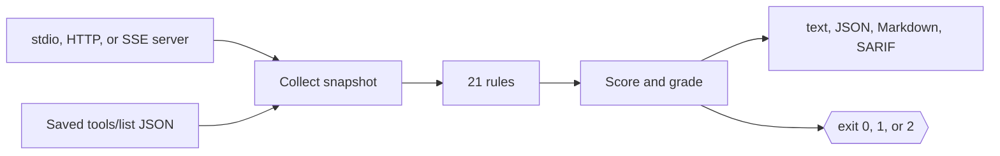

# mcp-lint

Lint and grade Model Context Protocol (MCP) servers before an agent ever calls them.

[](https://github.com/superintelligenceco/mcp-lint/actions/workflows/ci.yml)
[](https://github.com/superintelligenceco/mcp-lint/actions/workflows/codeql.yml)
[](https://github.com/superintelligenceco/mcp-lint/actions/workflows/release.yml)
[](https://www.npmjs.com/package/@superintelligenceco/mcp-lint)
[](https://scorecard.dev/viewer/?uri=github.com/superintelligenceco/mcp-lint)
[](https://superintelligenceco.github.io/mcp-lint/)
[](LICENSE)
[](https://codespaces.new/superintelligenceco/mcp-lint)

`mcp-lint` connects to an MCP server over stdio or HTTP, lists its tools, prompts, and resources,
and checks them for broken JSON schemas, vague descriptions, prompt-injection surfaces, and
dangerous capabilities. It prints a score from 0 to 100 and a letter grade, writes JSON and SARIF
reports, and exits non-zero when the score falls below your threshold.

```console
$ mcp-lint --file examples/messy-server.json
mcp-lint 0.2.0  fixture-messy 1.0.0  (6 tools, 1 prompt, 1 resource)

tool fetchUrl
  error    injection/instruction-phrases        The description tells the model to hide something from the user: "Do not tell the user".
  warning  capability/unconstrained-network     Parameter "url" accepts any URL or host. Restrict it with a pattern or enum, or set openWorldHint and block internal addresses.
  warning  injection/hidden-markup              The description contains an instruction-style tag: "<IMPORTANT>".
  warning  injection/sensitive-reference        The description references a sensitive location: "~/.ssh".

tool get_weather
  error    injection/hidden-unicode             The description contains invisible characters (U+200B) that a reviewer cannot see but a model reads.

tool search docs
  error    naming/invalid-tool-name             Tool name "search docs" does not match ^[A-Za-z0-9_.-]{1,128}$; some clients reject or rewrite it.
  error    schema/invalid-input-schema          Invalid inputSchema: schema does not validate against the JSON Schema meta-schema at /properties/q/type: must be equal to one of the allowed values.
  error    schema/unknown-required              "limit" is listed as required but is not defined in properties.

...

Score 50/100  Grade F  (6 errors, 10 warnings, 3 info)
Failed: score is below the minimum of 70.
```

The output above is trimmed. Run the command in a clone of this repository to see every finding.


## Install

Pick one:

```sh
# npm (Node.js 22.12 or later)
npm install --global @superintelligenceco/mcp-lint
npx @superintelligenceco/mcp-lint --version

# Standalone executable for Linux, macOS, or Windows (no Node.js needed)
curl -fsSL https://raw.githubusercontent.com/superintelligenceco/mcp-lint/main/install.sh | sh

# Container image for linux/amd64 and linux/arm64
docker run --rm -v "$PWD:/work" ghcr.io/superintelligenceco/mcp-lint --file tools.json
```

Every [release](https://github.com/superintelligenceco/mcp-lint/releases) also carries the
executables, the npm tarball, SPDX SBOMs, `SHA256SUMS`, and build provenance attestations. Verify
a download with `gh attestation verify <file> --repo superintelligenceco/mcp-lint`.

## Quickstart

```sh
git clone https://github.com/superintelligenceco/mcp-lint.git && cd mcp-lint
npm ci && npm run build
node dist/cli.js --file examples/messy-server.json
```

To lint your own stdio server, put its command after `--`:

```sh
node dist/cli.js -- node path/to/your-server.js
```

## Why it exists

An MCP server's tool metadata goes straight into a model's context. A description that says
"ignore previous instructions", a zero-width space hiding text from reviewers, or a `run_command`
tool that takes any string are all problems that a unit test of the server itself does not catch.
Schema mistakes are quieter but just as costly: a missing `inputSchema` or a `required` field that
does not exist makes clients reject the tool or makes the model guess.

`mcp-lint` checks the surface the model actually sees, the same way ESLint checks source code, and
turns the result into a number you can gate a pull request on.

## Features

- Connects over stdio, Streamable HTTP, or HTTP+SSE, and follows `nextCursor` pagination.
- Lints a saved `tools/list` result offline with `--file`, so you can check a server without
  running it.
- Ships 21 rules in five categories: schema, description, injection, capability, and naming.
- Scores each tool, prompt, and resource separately, then averages them, so one weak tool does not
  sink a large server. Any prompt-injection error caps the score at 50.
- Writes text, JSON, Markdown, and SARIF 2.1.0. SARIF plugs into GitHub code scanning.
- Exits `0` on pass, `1` below the minimum score, and `2` on a usage or connection error.
- Includes a GitHub Action that builds the CLI, writes a job summary, exposes `score` and `grade`
  outputs, and optionally uploads SARIF.

## How it works



Read the [architecture page](https://superintelligenceco.github.io/mcp-lint/architecture/) for
the details.

## Usage

```text
mcp-lint [options] -- <command> [args...]   Launch a stdio server and lint it
mcp-lint [options] --url <url>              Lint a Streamable HTTP (or SSE) server
mcp-lint [options] --file <tools.json>      Lint a saved tools/list response
```

Common options:

| Option | Description |
| --- | --- |
| `-f, --file <path>` | Saved `tools/list` result, JSON-RPC response, or `--save` snapshot. |
| `-u, --url <url>` | Server URL. Tries Streamable HTTP, then HTTP+SSE. |
| `-H, --header <k: v>` | HTTP header for `--url`. Repeatable. |
| `--stdio <cmdline>` | Server command as one string, for example `"node server.js"`. |
| `-e, --env <KEY=VALUE>` | Extra environment variable for a stdio server. Repeatable. |
| `--format <fmt>` | `text`, `json`, `sarif`, or `markdown`. Defaults to `text`. |
| `-o, --output <path>` | Write the report to a file instead of stdout. |
| `--json`, `--sarif`, `--markdown <path>` | Also write that report format to a file. |
| `--save <path>` | Save the collected snapshot for later `--file` runs. |
| `--min-score <n>` | Exit `1` when the score is below `n`. Defaults to `70`. |
| `--list-rules` | Print every rule and exit. |

Run `mcp-lint --help` for the full list.

### Examples

Lint a local server and write SARIF alongside the text report:

```sh
mcp-lint --sarif mcp-lint.sarif -- npx -y @modelcontextprotocol/server-everything
```

Lint a remote server that needs a token:

```sh
mcp-lint --url https://mcp.example.com/mcp -H "Authorization: Bearer $MCP_TOKEN"
```

Snapshot a server once, then lint the snapshot in CI without starting the server:

```sh
mcp-lint --save mcp-snapshot.json -- node dist/server.js
mcp-lint --file mcp-snapshot.json --min-score 85
```

### GitHub Action

```yaml
permissions:
  contents: read
  security-events: write

steps:
  - uses: actions/checkout@v7
  - uses: superintelligenceco/mcp-lint@v0.2.0
    with:
      command: node dist/server.js
      min-score: "80"
      upload-sarif: "true"
```

The action accepts `command`, `url`, `headers`, `file`, `config`, `min-score`, `sarif-file`,
`sarif-uri`, `upload-sarif`, and `node-version`. It sets the `score`, `grade`, `passed`, and
`sarif-file` outputs. See [`action.yml`](action.yml) and
[`examples/github-workflow.yml`](examples/github-workflow.yml).

## Configuration

`mcp-lint` reads `.mcp-lint.json` or `mcp-lint.config.json` from the working directory, or the
file you pass with `--config`. Every key is optional.

```json
{
  "minScore": 80,
  "rules": {
    "capability/shell-exec": "error",
    "naming/inconsistent-style": "off"
  },
  "ignoreTools": ["debug_dump"],
  "options": {
    "descriptionMinLength": 30,
    "descriptionMaxLength": 1024
  }
}
```

| Key | Description |
| --- | --- |
| `minScore` | Minimum passing score from 0 to 100. Defaults to `70`. `--min-score` overrides it. |
| `rules` | Map of rule ID to `error`, `warning`, `info`, or `off`. |
| `ignoreTools` | Tool names to skip entirely. |
| `options.descriptionMinLength` | Shortest acceptable tool description. Defaults to `20`. |
| `options.descriptionMaxLength` | Longest tool description before `description/too-long` fires. Defaults to `1024`. |

Unknown keys and unknown rule IDs are errors, so a typo does not silently disable a rule.

## Scoring

Each tool, prompt, resource, and resource template starts at 100. Every finding on it subtracts
25 for an error, 8 for a warning, and 2 for info, down to a floor of 0. The server score is the
mean of those entity scores, minus any server-level findings. If any `injection/*` rule reports an
error, the score is capped at 50.

| Grade | Score |
| --- | --- |
| A | 90 to 100 |
| B | 80 to 89 |
| C | 70 to 79 |
| D | 60 to 69 |
| F | below 60 |

## Rule reference

| Rule | Default | Checks that |
| --- | --- | --- |
| `schema/missing-input-schema` | error | Every tool declares an `inputSchema`, as the MCP specification requires. |
| `schema/invalid-input-schema` | error | `inputSchema` is a valid JSON Schema whose root type is `object`. |
| `schema/invalid-output-schema` | error | `outputSchema`, when present, is a valid JSON Schema. |
| `schema/missing-param-description` | warning | Every parameter has a description the model can read. |
| `schema/untyped-param` | warning | Every parameter declares a type, enum, const, or composition keyword. |
| `schema/unknown-required` | error | Every name in `required` exists in `properties`. |
| `description/missing` | error | Every tool and prompt has a description. |
| `description/too-short` | warning | Tool descriptions explain what the tool does and when to use it. |
| `description/too-long` | info | Tool descriptions do not crowd the model's context window. |
| `description/vague` | warning | Descriptions say something the tool name does not already say. |
| `injection/instruction-phrases` | error | Metadata has no instructions aimed at the model, such as "ignore previous instructions". |
| `injection/hidden-unicode` | error | Metadata has no invisible or bidirectional-control characters. |
| `injection/hidden-markup` | warning | Metadata has no HTML comments or instruction-style tags such as `<IMPORTANT>`. |
| `injection/sensitive-reference` | warning | Metadata does not reference credential files, SSH keys, or secret environment variables. |
| `capability/shell-exec` | warning | Tools that run arbitrary shell commands get flagged for review. |
| `capability/unconstrained-file-write` | warning | Tools that write, move, or delete files constrain the paths they accept. |
| `capability/unconstrained-network` | warning | Tools that take a URL or host restrict where requests can go. |
| `capability/missing-annotations` | info | Tools that change state declare `readOnlyHint` or `destructiveHint`, and the hints match the name. |
| `naming/invalid-tool-name` | error | Tool names use only `A-Z a-z 0-9 _ - .` and are 1 to 128 characters long. |
| `naming/duplicate-name` | error | Tool names, prompt names, and resource URIs are unique. |
| `naming/inconsistent-style` | info | Tool names follow one casing convention. |

## Library use

```ts
import { lint, readSnapshotFile } from "@superintelligenceco/mcp-lint";

const { snapshot } = readSnapshotFile("tools.json");
const result = lint(snapshot);
console.log(result.score, result.grade, result.findings.length);
```

## Roadmap

- Inline suppressions for a single finding, with a required reason.
- Rules for tool output: lint `structuredContent` against `outputSchema` from a sample call.
- Checks for resource and prompt content, not only their metadata.
- A diff mode that reports only findings a pull request introduces.

## Contributing

Bug reports, rule ideas, and pull requests are welcome. Read [CONTRIBUTING.md](CONTRIBUTING.md)
to set up the project, and [SECURITY.md](SECURITY.md) to report a vulnerability privately.

## License

[Apache-2.0](LICENSE)
