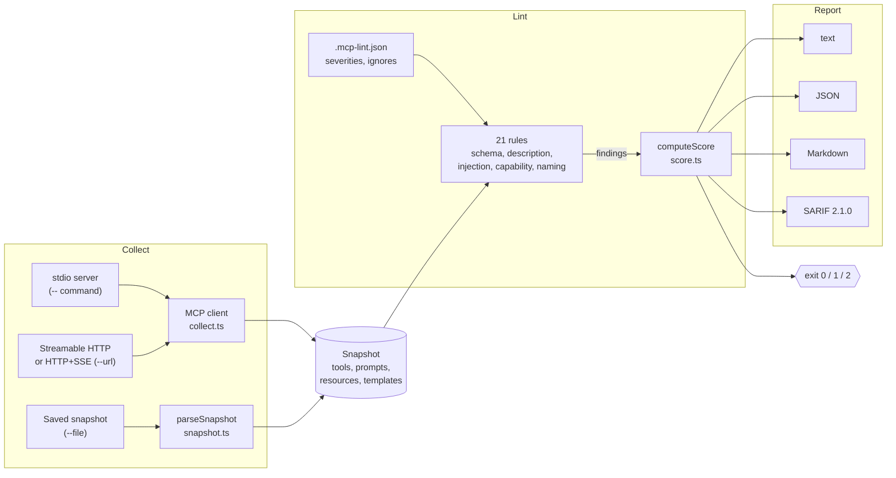

# Architecture

A run has three stages: collect a snapshot, lint it, and report the result. Each stage is a plain
function, so the CLI, the GitHub Action, and the library API share the same code.

## Collect

`collect.ts` connects with the official TypeScript SDK and pages through `tools/list`,
`prompts/list`, `resources/list`, and `resources/templates/list`, following `nextCursor`. It sends
raw requests instead of the SDK's typed helpers, because those helpers reject exactly the
malformed tools a linter needs to report (see [ADR 0003](adr/0003-permissive-list-requests.md)).

`snapshot.ts` accepts a bare `tools/list` result, a full JSON-RPC response, or a snapshot written
by `--save`, and remembers the line where each tool starts so SARIF results point at it.

## Lint

Every rule has an ID of the form `category/name`, a default severity, and a `check` function that
receives the snapshot and a `report` callback. `lint.ts` runs the enabled rules, applies severity
overrides from the config, and sorts findings by entity and severity.

## Score

Each tool, prompt, resource, and resource template starts at 100 and loses 25 per error, 8 per
warning, and 2 per info finding. The server score is the mean of the entity scores, minus
server-level findings, and any `injection/*` error caps it at 50
(see [ADR 0002](adr/0002-average-entity-scores-and-cap-on-injection.md)).

## Report

The reporters in `src/report/` turn one `LintResult` into text, JSON, Markdown, or SARIF. The CLI
maps the result to an exit code: `0` passed, `1` below the minimum score, `2` usage or connection
error.

## Distribution

The same source ships four ways: the npm package (`tsc` output), standalone executables compiled
with `bun build --compile`, a container image that runs a single bundled JavaScript file on
Node.js, and a composite GitHub Action that builds the CLI from the tagged source.
